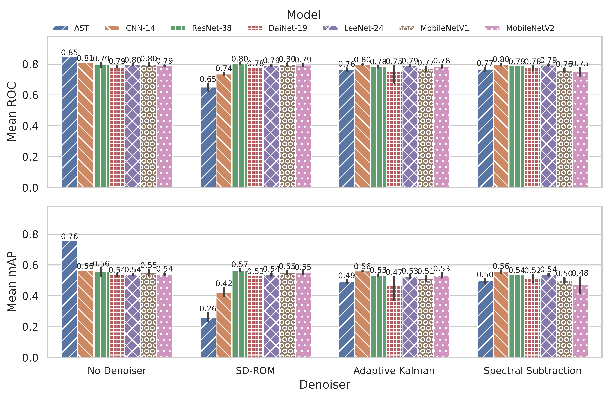

# A Comparative Analysis of Denoising Methods for Deep Learning-Based Audio Event Detection

This repository contains the source code for the paper "A Comparative Analysis of Denoising Methods for Deep Learning-Based Audio Event Detection in Noisy Agricultural Environments".

The study investigates whether traditional denoising methods improve the performance of deep learning models for Audio Event Detection (AED) in noisy real-world environments, specifically a commercial swine barn. Using the aSwine dataset, we evaluate several state-of-the-art models (PANNs, AST) with and without three different denoising algorithms: Spectral Subtraction (SS), Adaptive Kalman Filter (KF), and Single Dependent Rank-Ordered Mean (SD-ROM).

Our findings indicate that, contrary to conventional wisdom, applying these denoising techniques as a preprocessing step is detrimental to model performance. The results suggest that modern deep learning architectures are capable of learning to be inherently robust to the specific noise profiles present in the training data, making an explicit denoising step unnecessary and even harmful.

## Usage

The experiments are managed through the command-line interface `cli.py`.

### Prerequisites

1.  Clone the repository:
    ```bash
    git clone https://github.com/andremsouza/denoise-aed.git
    cd denoise-aed
    ```

2.  Install the required dependencies:
    ```bash
    pip install -r requirements.txt
    ```

### Running Experiments

The main script `cli.py` allows you to run single experiments, perform hyperparameter optimization with Optuna, or run an experiment using the best parameters from an optimization study.

You must specify a model architecture (`-m` or `--model-type`) and a denoiser (`-d` or `--denoiser`). Use `identity` for the baseline experiment without denoising.

**Available Models:**
`ast`, `cnn14`, `dainet19`, `leenet24`, `mobilenetv1`, `mobilenetv2`, `resnet38`

**Available Denoisers:**
`identity`, `kalman`, `sdrom`, `spectral_subtraction`

#### Example 1: Run a single experiment

This example runs the Audio Spectrogram Transformer (`ast`) model with the Spectral Subtraction (`spectral_subtraction`) denoiser.

```bash
python cli.py \
    --model-type ast \
    --denoiser spectral_subtraction \
    --data-dir /path/to/your/data \
    --annotation-file /path/to/your/annotations.csv \
    --batch-size 32 \
    --max-epochs 50 \
    --use-pretrained
```

#### Example 2: Run hyperparameter optimization

This example runs an Optuna hyperparameter optimization study for the `cnn14` model with the `kalman` denoiser.

```bash
python cli.py \
    --model-type cnn14 \
    --denoiser kalman \
    --data-dir /path/to/your/data \
    --annotation-file /path/to/your/annotations.csv \
    --optimize \
    --n-trials 100 \
    --storage "sqlite:///db.sqlite3" \
    --study-name "denoising_experiments"
```

#### Example 3: Run with best hyperparameters from a study

This example loads the best trial from the specified Optuna study and runs a final experiment with those parameters.

```bash
python cli.py \
    --model-type cnn14 \
    --denoiser kalman \
    --data-dir /path/to/your/data \
    --annotation-file /path/to/your/annotations.csv \
    --run-best-optuna \
    --storage "sqlite:///db.sqlite3" \
    --study-name "denoising_experiments"
```

## Results

The key finding of this study is that traditional denoising methods are detrimental to the performance of the evaluated deep learning models on this specific dataset and task. The models consistently achieved higher performance (in terms of weighted-average AUC and mAP) when trained on the raw, noisy audio compared to audio preprocessed with any of the denoising algorithms.

This suggests that the models are capable of learning robust features directly from the noisy data, effectively making them their own denoisers. The preprocessing step, instead of helping, appears to remove or distort important information that the models use for classification.

The figure below, taken from the paper, illustrates this finding. The "No Denoiser" (baseline) condition consistently outperforms the other methods across all evaluated model architectures.



## Citation

If you use this code or find our work relevant to your research, please cite our paper:

```bibtex
@inproceedings{souza2025denoise,
  author    = {Andr{\'e} Moreira Souza and Guilherme Augusto Moreira and Lucas Eduardo Gulka Pulcinelli},
  title     = {A Comparative Analysis of Denoising Methods for Deep Learning-Based Audio Event Detection in Noisy Agricultural Environments},
  booktitle = {Proceedings of the Brazilian Symposium on Databases (SBBD)},
  year      = {2025},
  address   = {S{\~a}o Carlos, SP, Brazil},
  publisher = {Sociedade Brasileira de Computa{\c c}{\~a}o (SBC)}
}
```
